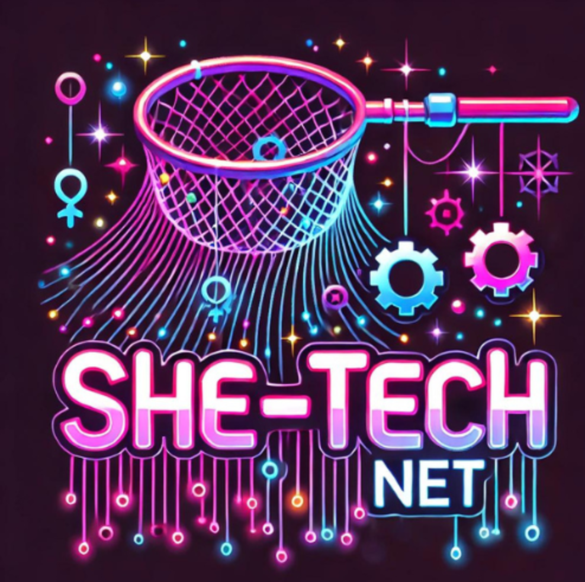
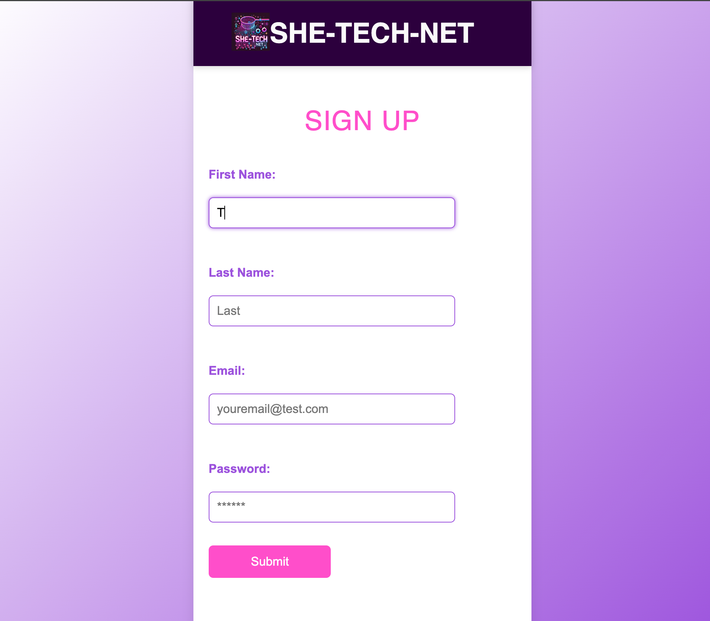
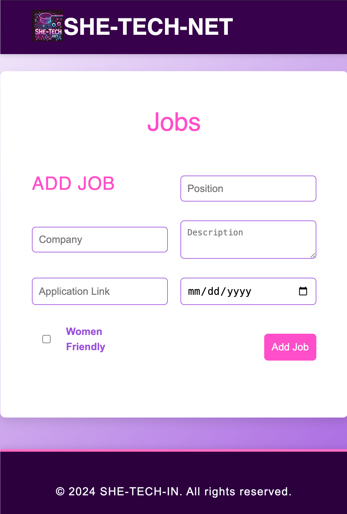
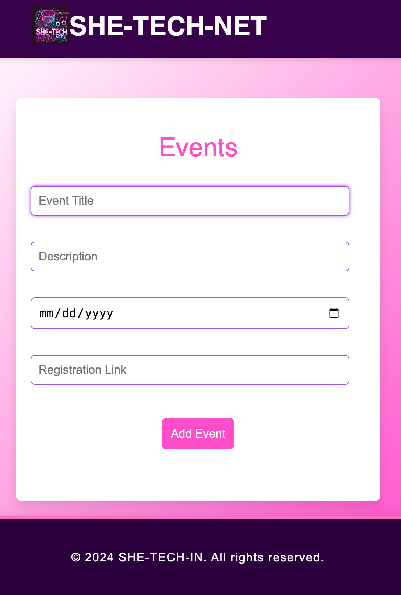

# SHE-TECH-NET

SHE-TECH-IN is a tech learning and mentorship platform designed to empower women by providing accessible tech education, mentorship, networking opportunities, job listings, and real-time coding challenges. This platform focuses on supporting women in their journey into the tech world, providing a safe and inclusive community for learning and growth.

## Table of Contents
- [Project Overview](#project-overview)
- [Features](#features)
- [Technologies Used](#technologies-used)
- [Project Structure](#project-structure)
- [Installation Instructions](#installation-instructions)
- [Usage Instructions](#usage-instructions)
- [Screenshots](#screenshots)
- [Deployed Link](#deployed-link)
- [Future Enhancements](#future-enhancements)
- [Contributing](#contributing)
- [License](#license)

## Project Overview

SHE-TECH-NET is a full-featured tech platform focused on fostering the growth of women in the technology sector. Whether users are just starting out in tech, looking to advance their skills, or seeking mentorship and community support, SHE-TECH-NET aims to provide comprehensive support. With tailored resources, tutorials, and interactive learning components, the platform seeks to create a supportive environment for women to excel.

## Features

- **Courses & Tutorials**: Users can access a wide range of tech courses and tutorials on various topics such as web development. The content is curated to meet different levels of expertise, from beginner to advanced.
  
- **Mentorship Program**: The platform facilitates mentor-mentee relationships, allowing experienced professionals to guide newcomers. Users can browse mentors and request mentorship sessions.

- **Job Board**: A job board that features technology-related job listings tailored for women, with specific opportunities for entry-level to senior-level roles.

- **Events Listing**: Users can view and participate in tech-related events, such as workshops, webinars, and hackathons organized by SHE-TECH-IN or its partners.

- **Networking Opportunities**: Users can connect with other women in tech, join groups, and participate in discussions to build their professional network.

- **Authentication System**: Secure authentication using JSON Web Tokens (JWT) allows users to sign up, sign in, and manage their profiles. There are role-specific features for mentors and mentees.

## Technologies Used

### Frontend
- **React.js**: Used to build the interactive user interface with a component-based architecture.
- **CSS**: Styling for individual components and pages to maintain a cohesive and professional look throughout the platform.

### Backend
- **Node.js & Express.js**: The backend is developed using Node.js with Express.js to handle server-side logic and API requests.
- **MongoDB & Mongoose**: MongoDB is used as the database to store user, course, job, and event data, with Mongoose as the ORM.

### Additional Libraries & Tools
- **GraphQL**: For efficient data querying and handling communication between the frontend and backend.
- **JWT**: JSON Web Tokens are used for secure authentication.
- **Render**: For deployment, making the platform accessible online.
- **Testing Libraries**: Jest and React Testing Library for unit and integration tests to ensure code quality.

## Project Structure

```
she-tech-in/
 ├── client/                # Frontend part of the project
 │   ├── public/            # Public assets such as images, index.html
 │   ├── src/
 │       ├── assets/        # Static files such as images and fonts
 │       ├── components/    # Reusable UI components (Navbar, Footer, etc.)
 │       ├── pages/         # Page components (Courses, Jobs, Mentorship, etc.)
 │       ├── styles/        # CSS files for styling components and pages
 │       ├── tests/         # Unit and integration tests
 │       └── utils/         # Utility functions and API helpers
 ├── server/                # Backend part of the project
 │   ├── config/            # Database connection and configuration files
 │   ├── models/            # Mongoose models for MongoDB
 │   ├── routes/            # API routes for various features (auth, jobs, courses)
 │   ├── controllers/       # Functions to handle incoming requests
 │   └── server.js          # Entry point for the Express server
 └── README.md              # Documentation
```

## Installation Instructions

1. **Clone the repository**:
   ```bash
   git clone https://github.com/AshleydVon/She-Tech-Net.git
   ```
2. **Navigate to the project directory**:
   ```bash
   cd she-tech-in
   ```
3. **Install dependencies for the client**:
   ```bash
   cd client
   npm install
   ```
4. **Install dependencies for the server**:
   ```bash
   cd ../server
   npm install
   ```
5. **Environment Variables**:
   - Create a `.env` file in the server directory with the necessary configuration details (e.g., MongoDB URI, JWT secret).

## Usage Instructions

### Running the Development Environment

1. **Start the backend server**:
   ```bash
   cd server
   npm run start
   ```
2. **Start the frontend client**:
   ```bash
   cd ../client
   npm start
   ```
3. **Access the platform**:
   - Open your browser and navigate to `http://localhost:3000`.

## Screenshots of project








## Deployed link
[Please, Visit our website here!]( https://she-tech-net.onrender.com)

## Future Enhancements

- **PWA Functionality**: Turn SHE-TECH-IN into a Progressive Web Application for better accessibility and offline capabilities.
- **Admin Dashboard**: Develop an admin dashboard for managing course content, job postings, and events.
- **Notification System**: Add real-time notifications for mentorship requests, events, and forum responses.
- **Advanced Analytics**: Provide mentors and mentees with personalized analytics about their learning journey and progress.

## Contributing

Contributions are welcome! To contribute:

1. Fork the repository.
2. Create a new feature branch: `git checkout -b feature-branch-name`.
3. Commit your changes: `git commit -m 'Add some feature'`.
4. Push to the branch: `git push origin feature-branch-name`.
5. Create a pull request.

Please ensure your code adheres to the existing style and includes unit tests where applicable.

## License

This project is licensed under the MIT License. See the [LICENSE](LICENSE) file for more information.

